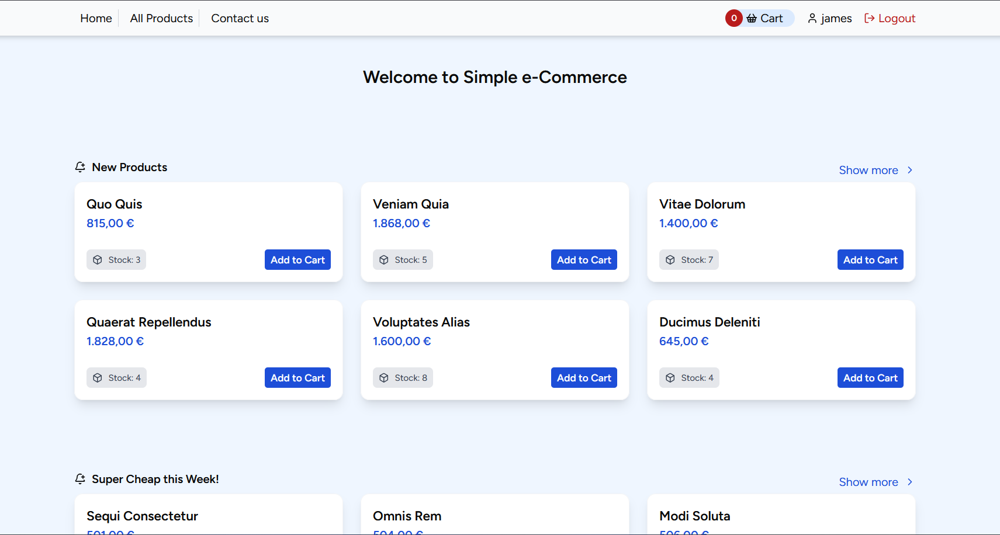
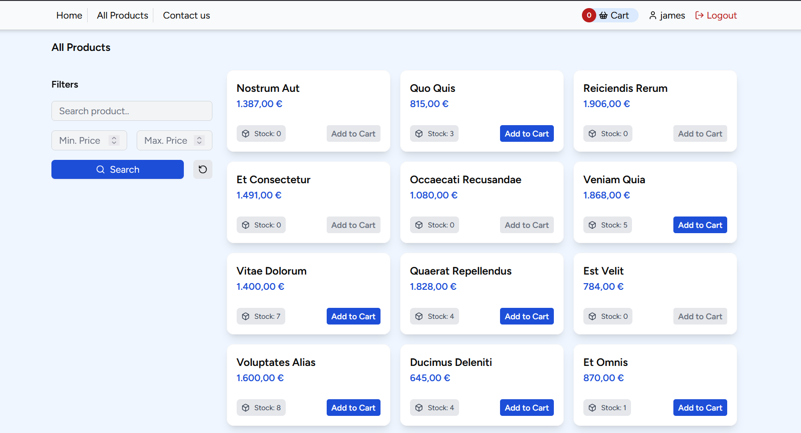
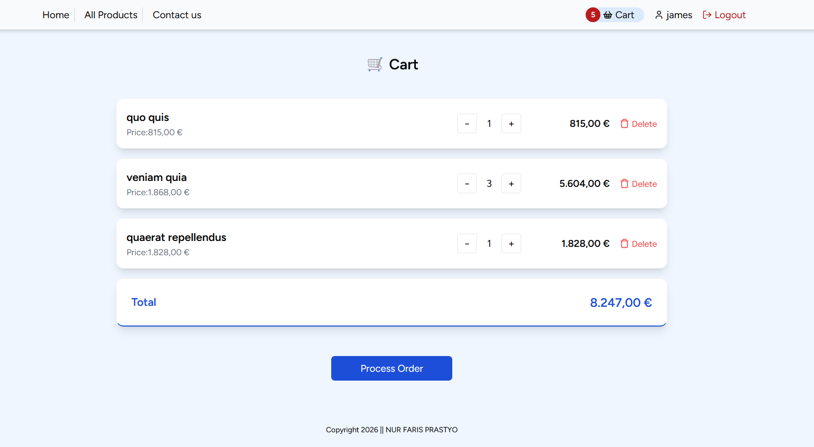
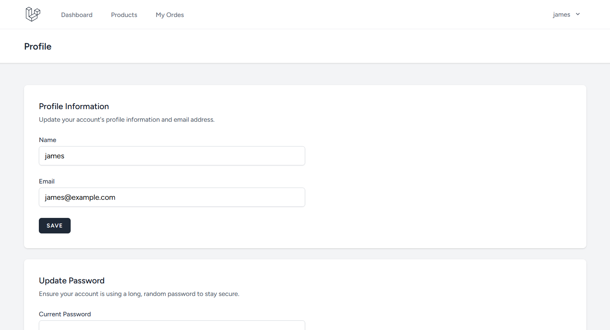
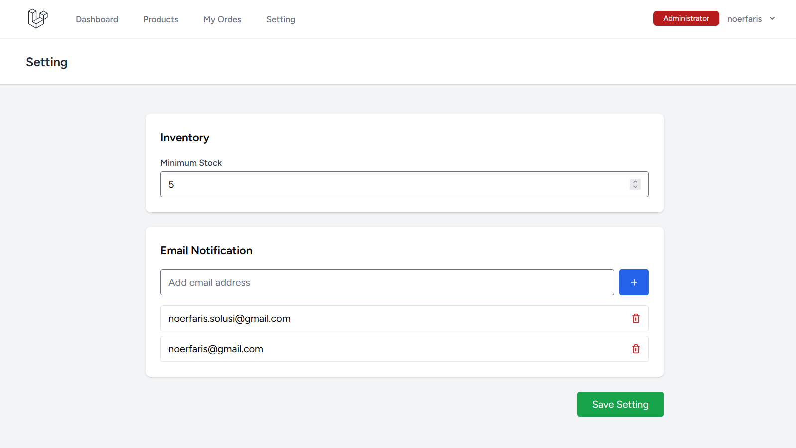
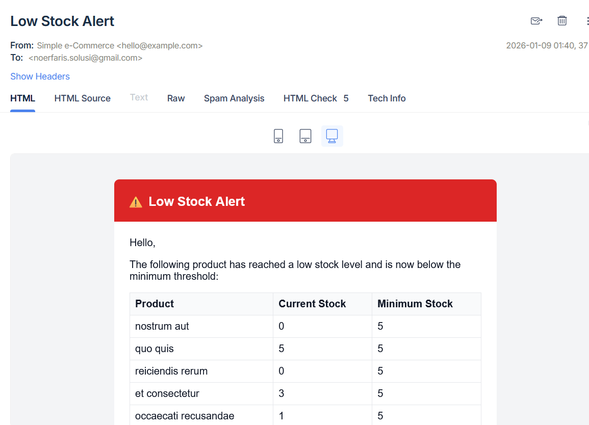
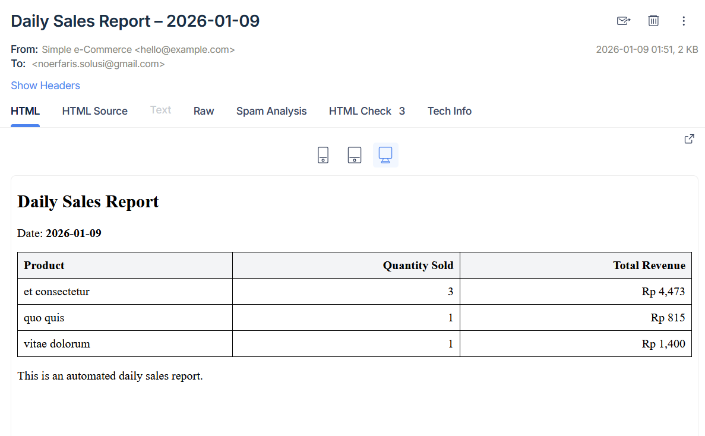

# Simple e-Commerce Shopping Cart
Job Tasks at Trustfactory | This project is built using **Laravel** as the backend and **Inertia.js with React** as the frontend.

---

## Tech
- Laravel 12
- Inertia JS v2 + React Js
- TailwindCss

## Requirement
- Min. PHP 8.3
- MariaDB / MySQL 8
- Composer
- Node.js & NPM / Yarn
- Git

---

## Installation

Clone the repository:

```bash
git clone https://github.com/noerfariss/simple-ecommerce.git
cd simple-ecommerce

```

Install backend dependencies:

```bash
composer install
```

Install frontend dependencies:

```bash
npm install or yarn
```

---

## Environment Setup

Copy environment file:

```bash
cp .env.example .env
```

Generate application key:

```bash
php artisan key:generate
```

Configure your database in `.env`.

---

## Run the Application

Run database migration:

```bash
php artisan migrate
```

```bash
php artisan db:seed
```

Start Laravel server:

```bash
php artisan serve 

or if you are using local web server such Laragon / Herd you can running the application via url
https://simple-ecommerce.test
```

Start Vite (React + Inertia):

```bash
npm run dev or yarn dev
```

---

__

## Website features
- Login & Register user -- auto install via Laravel breeze
- Login Administrator
- Data Product
- Data Cart (base on Database)
- Setting Page (to configure minimum product stock and email notification recipients)

---


## Screenshots

### Home page


--

### All Products


--

### Cart Page


--

### My Order


--

### Profile


--

### Setting (only administrator)


--

### Email notification (Low Stock)


--

### Setting (Daily Sales Report)



--

---

## Data users
- james@example.com
- robert@example.com
- dixon@example.com
- noerfaris.solusi@gmail.com (superadmin / administrator)
